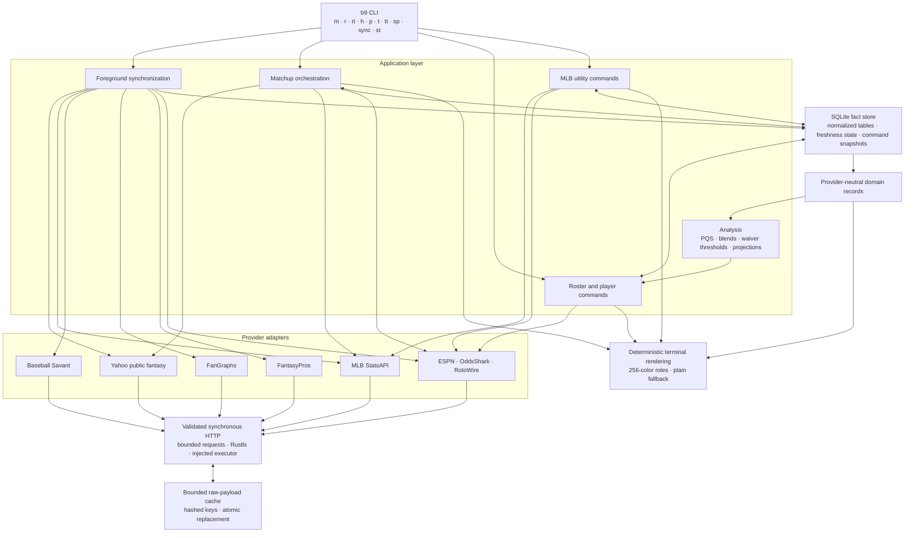
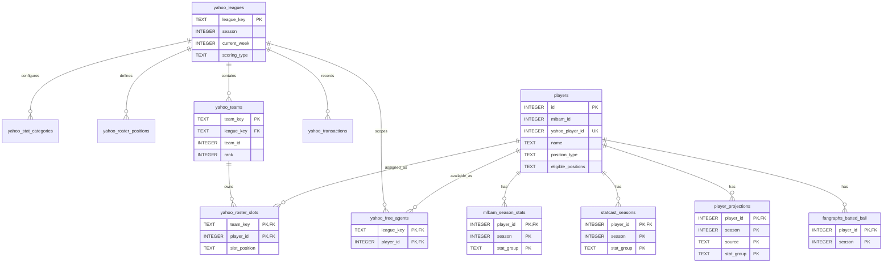

# b9 Architecture

## Overview

b9 is a local-first, read-only decision-support CLI for Yahoo Fantasy Baseball. It acquires public Yahoo league and matchup data, enriches player identities and performance with MLB and analytical sources, stores normalized facts and durable command snapshots in an isolated SQLite database, derives fantasy signals, and renders deterministic terminal views. It never authenticates with Yahoo and never changes a Yahoo roster.

The primary command is `b9 m`. Its default view combines today's MLB player statistics and game state with the running Yahoo matchup score. Weekly and historical selections use Yahoo period statistics and durable snapshots. Roster, player-pool, MLB-team, standings, and probable-pitcher commands reuse the same provider-neutral domain and storage boundaries.

## Architecture Principles

- Keep external payloads inside provider adapters.
- Keep domain records independent from transport, persistence, serialization, and terminal rendering.
- Stage complete provider results before replacing durable state.
- Preserve the last complete snapshot when a refresh fails.
- Keep Yahoo acquisition public-only, allowlisted, and scoped to the configured league.
- Keep synchronization foreground-only and explicitly invoked.
- Keep every Yahoo-facing operation advisory and read-only.
- Render the same information hierarchy in color and plain-text terminals.
- Return contextual errors with a recovery action at command boundaries.

## System Diagram



## Layer Responsibilities

| Layer | Primary modules | Responsibility |
|-------|-----------------|----------------|
| Entry and CLI | `src/main.rs`, `src/cli.rs` | Version declaration, command metadata, parsing, dispatch, streams, and exit behavior |
| Application | `src/sync.rs`, `src/matchup.rs`, `src/player_commands.rs`, `src/mlb_commands.rs`, `src/operations.rs`, `src/fetch_command.rs` | Orchestration, freshness decisions, provider composition, fallback selection, and user-facing errors |
| Analysis | `src/analysis/` | PQS, early-season blending, pitcher roles, waiver thresholds, Statcast blending, and projection windows |
| Domain | `src/domain.rs` | Provider-neutral fantasy and baseball records, positions, statistics, and invariants |
| Providers | `src/providers/` | Endpoint construction, retrieval, typed decoding, normalization, and source-specific partial failures |
| Transport and cache | `src/transport.rs`, `src/cache.rs` | Request validation, bounded synchronous HTTP, injected execution, raw-payload caching, and atomic cache writes |
| Persistence | `src/store.rs`, `src/store/` | Schema migration, normalized fact storage, identity resolution, freshness state, snapshots, and transactions |
| Presentation | `src/player_display.rs`, `src/mlb_display.rs`, `src/terminal.rs`, matchup rendering | Fixed-width tables, status hierarchy, ANSI-safe widths, semantic color, and plain fallback |
| Reference | `src/glossary.rs` | Embedded offline glossary parsing, lookup, suggestions, and rendering |

## Provider Boundaries

### Yahoo Fantasy

`src/providers/yahoo_public.rs` owns the two unauthenticated public Yahoo fantasy hosts, exact allowlisted paths, bounded pagination, league-key normalization, and public response acquisition. `src/providers/yahoo_fantasy.rs` owns shared typed parsing for league settings, standings, teams, rosters, free agents, scoreboards, ranks, and weekly or daily player statistics.

b9 sends no Yahoo authorization header, cookie, or browser state. Account-wide league discovery is unavailable, so the operator supplies a league and primary team. Synchronization validates all required Yahoo resources and the selected team before replacing the prior complete fantasy snapshot. Public denial or incompatible payloads are provider failures; b9 does not evade them.

### MLB and Analytical Sources

`src/providers/mlb.rs` owns MLB identities, 40-man rosters, schedules, live game state, season and date-range statistics, game logs, and quality-start supplementation. It batches bounded requests and uses short-lived raw caching where repeated MLB payloads are safe to reuse.

Baseball Savant supplies Statcast metrics. FanGraphs supplies projections, advanced rates, and closer-role context. FantasyPros supplies ECR. These adapters emit source-owned records; synchronization resolves identities and chooses normalized writes.

### Game Context

ESPN supplies current-day game and moneyline context. OddsShark supplies optional future-game odds. RotoWire supplies confirmed lineup and probable-pitcher context for roster presentation. Optional odds and lineup enrichments never own command success; integration code retains typed warnings or falls back to the core MLB/Yahoo view.

## Data and Control Flow

### Foreground Synchronization

`b9 sync` acquires the configured public Yahoo league, settings, standings, complete rosters, and bounded free-agent set. It also refreshes MLB identities, rosters, statistics, schedules, Savant metrics, FanGraphs data, FantasyPros ECR, and available game context. Independent provider steps continue after unrelated failures and report their result immediately.

Yahoo facts are staged and validated before one atomic fantasy-snapshot replacement. Other complete datasets use scoped atomic replacement or versioned command snapshots. A persistent cross-process lock prevents overlapping foreground sync runs. `sync_runs`, item freshness, row freshness, season manifests, and dashboard status record the lifecycle without introducing a background daemon.

### Matchup

`b9 m` resolves the saved league and primary team, acquires or reuses a Yahoo scoreboard, then acquires both teams' roster statistics for the selected day or week. The default current-day view zeroes the roster stat cells and overlays exact-date MLB results through reconciled Yahoo-to-MLB identities; Yahoo's matchup totals still determine the category score and W/T/L summary. `-W` and `-w` retain weekly player totals.

Historical scoreboards and player rows are stored as versioned command snapshots. Sparse Yahoo historical metadata is enriched from normalized player identities before persistence. Empty or incompatible historical snapshots are rejected rather than rendered as successful data. Future matchup weeks fail explicitly.

### Roster and Player Pools

Roster and pool commands read normalized Yahoo ownership and eligibility together with MLB season facts, Savant metrics, FanGraphs projections, and FantasyPros ECR. Shared MLBAM identity is the statistics join boundary, including role-distinct two-way-player rows. Waiver filtering requires durable active-roster membership and role-relative usage floors before analysis and sorting.

Player detail cards may refresh an MLB game log on demand and retain a compatible per-player snapshot for labeled fallback. Analysis consumes durable facts; it does not call providers or own persistence.

### MLB Utilities

`b9 t`, `b9 tt`, and `b9 sp` route through `mlb_commands`. Team rosters and season totals use normalized MLB data. The three-day probable-pitcher slate composes MLB schedules with current-day ESPN and future OddsShark context. `-f` bypasses command freshness gates, while failed refreshes retain complete stale snapshots with a warning.

## Persistence

The store owns one SQLite connection at `~/.config/b9/b9.db`. Schema version 5 is applied through ordered, atomic migrations. The connection remains behind typed store APIs and immediate transactions; command and provider modules never issue ad hoc SQL.

### Table Groups

| Group | Tables | Purpose |
|-------|--------|---------|
| Schema and lifecycle | `schema_version`, `sync_log`, `sync_item_state`, `sync_row_state`, `sync_runs`, `dashboard_status`, `season_sync_status` | Migration state, source freshness, run lifecycle, circuit state, and historical completeness |
| Durable command data | `command_snapshots` | Versioned scoped payloads, last-success timestamps, stale state, and recovery errors |
| Yahoo league state | `yahoo_leagues`, `yahoo_stat_categories`, `yahoo_roster_positions`, `yahoo_teams`, `yahoo_roster_slots`, `yahoo_free_agents`, `yahoo_transactions` | League configuration, standings, ownership, roster slots, free agents, and retained transaction records |
| Identity and MLB facts | `players`, `mlbam_season_stats`, `mlb_game_schedule`, `mlb_team_active_rosters` | Local identities, Yahoo/MLB mappings, season statistics, schedules, and role-distinct 40-man rows |
| Analysis inputs | `statcast_seasons`, `player_projections`, `fangraphs_batted_ball` | Observed Statcast metrics, forecasts, and FanGraphs batted-ball facts |
| Odds | `mlb_odds` | Validated game and pitcher markets keyed by game, market, side, player, and sportsbook |

### Core Entity Diagram



SQLite does not declare foreign-key constraints for these logical relationships; typed replacement and query APIs enforce the ownership and join rules.

## Identity Model

`players.id` is the local row identity. `yahoo_player_id` identifies a Yahoo roster entry, while `mlbam_id` is the canonical statistics identity. Multiple local rows may share one MLBAM ID so a two-way player can retain separate fantasy roles. Shared statistics tables are keyed by the canonical local player row selected by store resolution.

Synchronization records how an MLB identity was established and when it was matched. Command paths that require exact daily statistics fail with unresolved player names instead of guessing. Historical Yahoo rows use exact Yahoo IDs to recover stored names, teams, and hitter/pitcher roles.

## Freshness and Recovery

Freshness policy belongs to application code, not provider adapters or SQLite queries. Normalized table replacements, command snapshots, and raw cache entries have distinct lifecycles:

- Complete normalized replacements preserve the prior dataset if staging or validation fails.
- Command snapshots retain the last successful payload, timestamp, version, stale flag, and error context.
- Raw provider cache entries are bounded opaque bytes under hashed logical keys and are replaced atomically.
- Failed refreshes do not advance successful timestamps or erase successful payloads.
- Cache pruning is explicit and independent from successful writes.
- Provider degradation remains typed until the application selects a warning, fallback, or command failure.

## Transport and Security

All production HTTP passes through `src/transport.rs`, which validates methods, origins, headers, redirect targets, response sizes, and timeouts before returning bytes to an adapter. The executor is injectable for deterministic tests; production uses blocking Rustls transport.

Cache keys and diagnostics exclude credentials and secrets. Yahoo requests carry no credentials at all. The raw `b9 fetch` command reaches only registered provider adapters and never writes normalized application data.

## Presentation

Application modules construct provider-neutral view data. Display modules own grouping, fixed widths, abbreviated player names, status priority, game-state formatting, and category highlighting. `src/terminal.rs` owns terminal capability detection and semantic color roles. Padding occurs against visible text so ANSI sequences and Unicode names do not break alignment.

Supported 256-color terminals receive semantic color. Redirected output, `NO_COLOR`, `TERM=dumb`, and terminals without advertised 256-color support receive the same hierarchy as plain text.

## File Layout

```text
b9/
├── src/
│   ├── analysis/              # PQS, blends, roles, waiver gates, projections
│   ├── providers/             # Yahoo, MLB, Savant, FanGraphs, FantasyPros, game context
│   ├── store/                 # typed persistence domains and schema
│   ├── cli.rs                 # command metadata, parsing, and dispatch
│   ├── domain.rs              # provider-neutral records and invariants
│   ├── matchup.rs             # daily, weekly, and historical matchup application
│   ├── player_commands.rs     # roster, totals, pools, and detail orchestration
│   ├── player_display.rs      # fantasy roster and player rendering
│   ├── mlb_commands.rs        # MLB roster, totals, and slate orchestration
│   ├── mlb_display.rs         # MLB rendering
│   ├── sync.rs                # foreground provider pipeline and status
│   ├── transport.rs           # validated HTTP boundary
│   └── terminal.rs            # color policy and visible-width helpers
├── tests/                     # integration, provider, storage, CLI, and display tests
├── govna/                     # governance and delivery documentation
├── AGENTS.md                  # active operator contract
├── README.md                  # user-facing introduction and usage
├── arch.md                    # this architecture reference
└── build.sh                   # canonical validation and release workflow
```

## Build and Release Boundary

`build.sh` is the canonical validation and release entry point. It validates independent utility declarations, formatting, Clippy, all tests, release compilation, and installed `--version` output. Release preparation updates Cargo package metadata and CHANGELOG state without changing the independently declared CLI version unless that declaration is explicitly in scope.

## Conventions

- Use “Savant” for the source and adapter; use “Statcast” for the stored and displayed data domain.
- Use `K` for total pitching strikeouts, not K/9, in fantasy-category views.
- Preserve source order for domain collections unless an application policy explicitly sorts them.
- Preserve unknown external scoring and position values until the owning adapter validates them.
- Keep MLB innings display notation distinct from internal thirds-based rate calculations.
- Keep source identity explicit in freshness and snapshot records.
- Keep status inspection local-only and free of provider traffic.
- Update this document when architecture, persistence, provider boundaries, or major command flows change materially.
